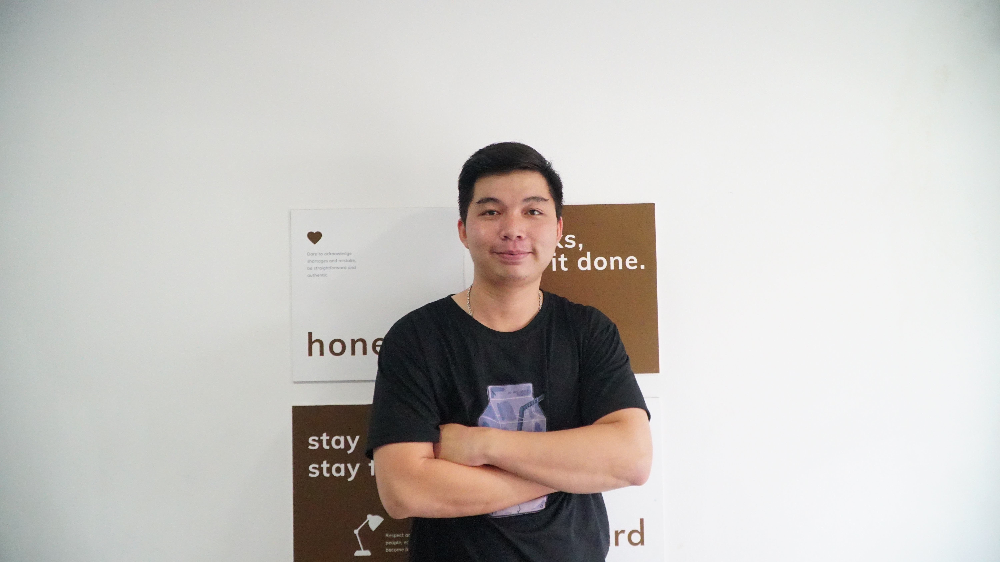

# Lam Van Manh

- ⛑ **Name**: Lam Van Manh
- 👶**Birthday**: 15/06/1999
- 🏰**Address**: Thu Duc, Ho Chi Minh, Viet Nam

## 🙋🏻‍♂️Brief introduction

> 🎖 Hi, I'm a front-end developer who can code all day without getting tired. I have a big dream working in silicon valley. I know it's very unlikely right now, but keep dreaming, because no one is taxing your dreams.

> 🏅 I like the most quote: "The number of years of work does not fully reflect a person's experience, I can work equivalent to people with 1-2 years of experience, otherwise you do not need to pay me"

Hi everyone, my journey into web programming was by accident, I started it with a part-time job designing non-coding landing pages.

At that time I had some complicated problems. I had to get help from a brother of mine, he wrote me a piece of code and I solved the problem. At that time, I had many questions in my mind. And that journey has stuck with me for a year.

I was very lucky that just getting started, I had the opportunity to participate in a real website-building project at my previous company. I was touched and it gave me a lot of experience from coding to presentation skills, thinking of a developer. These things help me confidently can apply for the position at your company.

## 👔Projects

### Shopee clone

This is a project to clone the user page of the e-commerce platform [Shopee](https://shopee.com).

**Technologies used**: REST API, ReactJs, Typescript, Tailwindcss, React Router, React Hook Form, Yup, React Query, Vite, Vitest, Storybook, ESLint, Prettier, React Helmet

**Functions include**:

- Manage authentication with JWT (automatic token refresh applied)
- Use the Yup and React Hook Form to validate the form.
- Smart Pagination, Filter, and Product Search
- Incorporate state into the URL to easily share results across devices.
- Asynchronous state management with React Query
- Code Splitting
- Improve performance by optimizing build file size analysis.
- SEO with React Helmet
- Separate the private and public routes.
- Unit Test
- Manage components with Storybook

**🔗Webiste**: [https://shopee-clone-a61a.vercel.app/](https://shopee-clone-a61a.vercel.app/)

**🔗Github**: [https://github.com/manhlam113/shopeeClone](https://github.com/manhlam113/shopeeClone)

### Simple Movie

This is my personal website to demo the Movie web app, which I designed and coded myself when I was just approached ReactJs. The website has one main page to display all films, when click each movie detail, it will direct you to a page detail. You can swiper movie to select.

**Technologies used**: ReactJs, Vitejs, Tailwindcss, ESLint, Prettier, React Router

**Functions include**:

- CSS with tailwindcss
- Linting with Prettier and ESLint
- React Router-dom to manage the router and outlet element
- Code Splitting
- Manage Component with react-router-dom

**🔗Webiste**: [https://react-simple-movie-part2.vercel.app/](https://react-simple-movie-part2.vercel.app/)

**🔗Github**: [https://github.com/manhlam113/react_simple_movie_part2](https://github.com/manhlam113/react_simple_movie_part2)

### Healthcare

A website that I coded from a design file on my project at school. This mini-website has 2 pages.
One page for a demo to fill out MEDICAL DECLARATION
(covid 19). One page to summarize statistics of the declarations that have been written by table

**Technologies used**: HTML5, SASS, Tailwindcss, Javascript

**Functions include**:

- Management Form with Yup
- Semantic HTML
- CRUD declarations that have been written by table

**🔗Webiste**: [https://health-care-olive.vercel.app](https://health-care-olive.vercel.app)

**🔗Github**: [https://github.com/manhlam113/health_care](https://github.com/manhlam113/health_care)

### Learning and Development Web App

This was the first project I did while working as an intern in front-end web programming. I use Umijs source base, and React Query to manage the state. I also have joined to update code at the Admin site with RefineJS source, it is so good to code CRUD functionality

**Technologies used**: ReactJS, Umijs source base, Refine, React Query, Rich Text(Toast Editor)

**Functions include**:

- Web app for desktop, PC, and mobile is all ready to be released soon
- Help a learner to create goals to study and develop
- Summary current level of learner
- Help admin to manage their student and get oriented immediately for learner

> This source is private, I don't have full authorization to access it.

## Working Experience

- 05/02/2023 - 05/05/2023 at GEEKUP Company

I have worked at this company in a Product front-end position, making response-ability to make beautiful UI, improve UX, and working with PA, and PD to make the decision final. Applying the Agile model for delivery product on hold journey. In my team, I take responses to capture information with PA, and PD and then display them with all my team. After each sprint, I supported making a content presentation

## 🔧Skills

### 🔠Programming Languages

Javascript, TypeScript.

I'm pretty confident that I can catch up with other languages when needed very quickly.

### 💻Web Front-end Technologies

React, React Query, RTK Query, Redux, Styled Components, TailwindCss, Sass, Webpack(learning...), Axios, Vite, Vitest, Mock Service Worker, HTML5, CSS3, SEO.

### 🧮Web Back-end Technologies

- Protocols: REST, HTTP(S)
- Frameworks/Libraries: Laravel
- Language: PHP

### 🔨Dev Tools

Git, Postman, Lighthouse, React Developer Tool, Redux Dev Tool, React Query Dev Tool, Github, Gitlab, Figma, VS Code, Bash

### 💁🏻‍♂️Industrial & Interpersonal Skills

Present, Teamwork, Trading, Sport, Guitar, Selling.

## 🥇Honors & Awards

- TOEIC 635 in 2020
- The Best Trainee at FPT SOFTWARE ACADEMY
- Certification of Recognition Intern Spring season

## 📚Education

**TDTU TON DUC THANG University** - Communications and Computer networks (reserves the study results) 2017 - 2019

**FPT Software Academy** - Professional ReactJS Course - 2022

**OPEN HCM University** - Internation Bussiness, 2019 - 2023

## 💋Languages

- **English**
  Read and understand technical documents. Good communication. TOEIC certificated 635

- **Vietnamese**

  Native speaker.

## ☎️Contact information

- 📞Phone: 0375 461 022
- 📧Email: [manhvanlam0699@gmail.com](mailto:manhvanlam0699@gmail.com)
- 🔗Github: [https://github.com/manhlam113](https://github.com/manhlam113)
- 🔗Facebook: [https://www.facebook.com/vanmanh69/](https://www.facebook.com/vanmanh69/)
- 🔗LinkedIn: [https://www.linkedin.com/in/manh-lam-407a21274/](https://www.linkedin.com/in/manh-lam-407a21274/)

## 🙏🏻Thanks!

> Looking forward to hearing from you - Lam Van Manh
